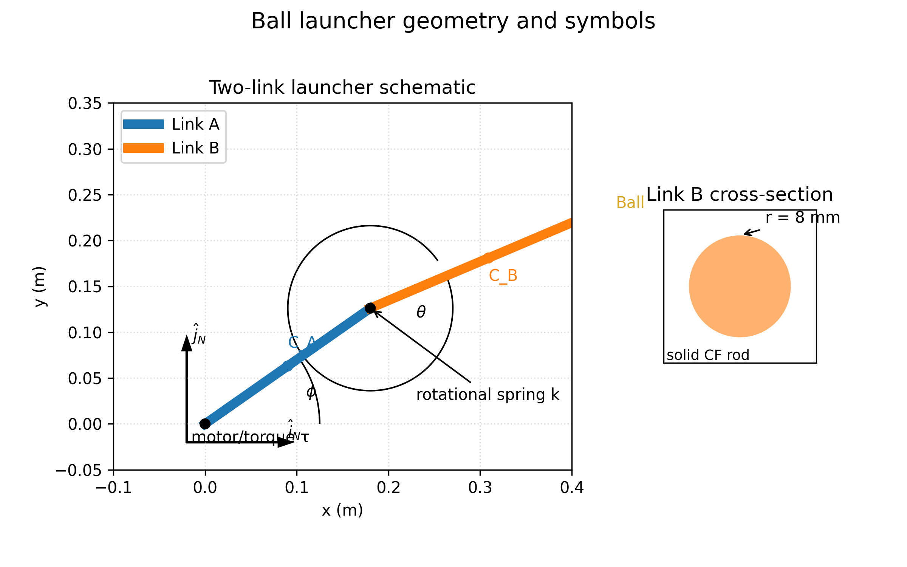
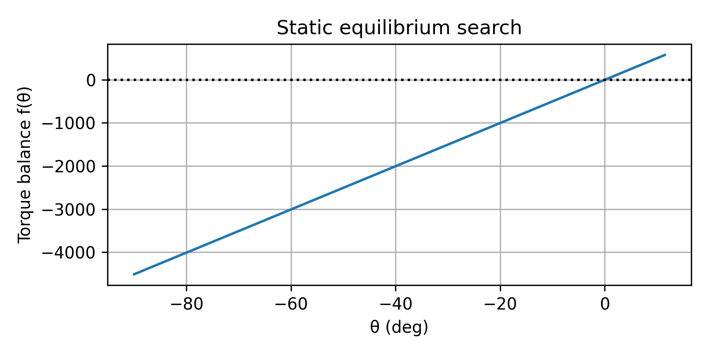
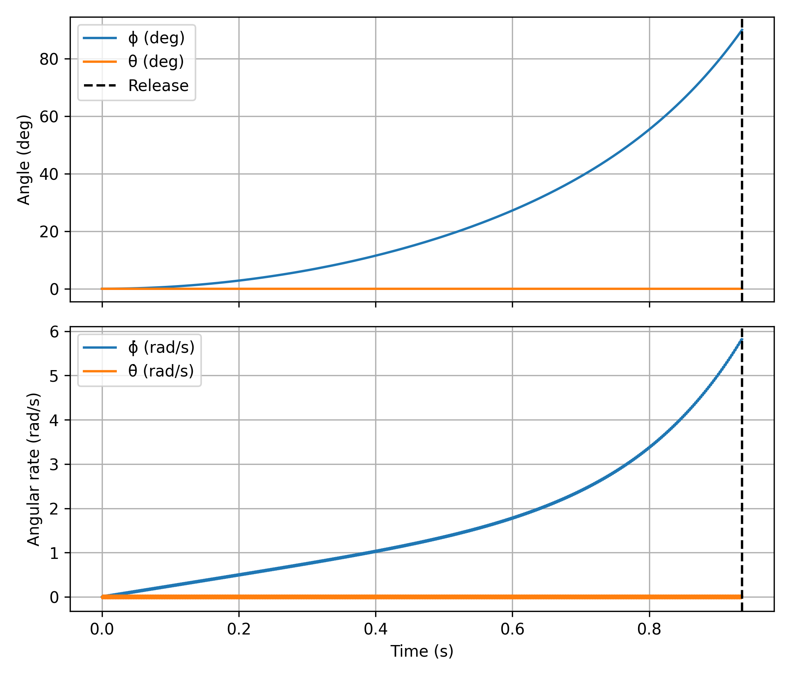
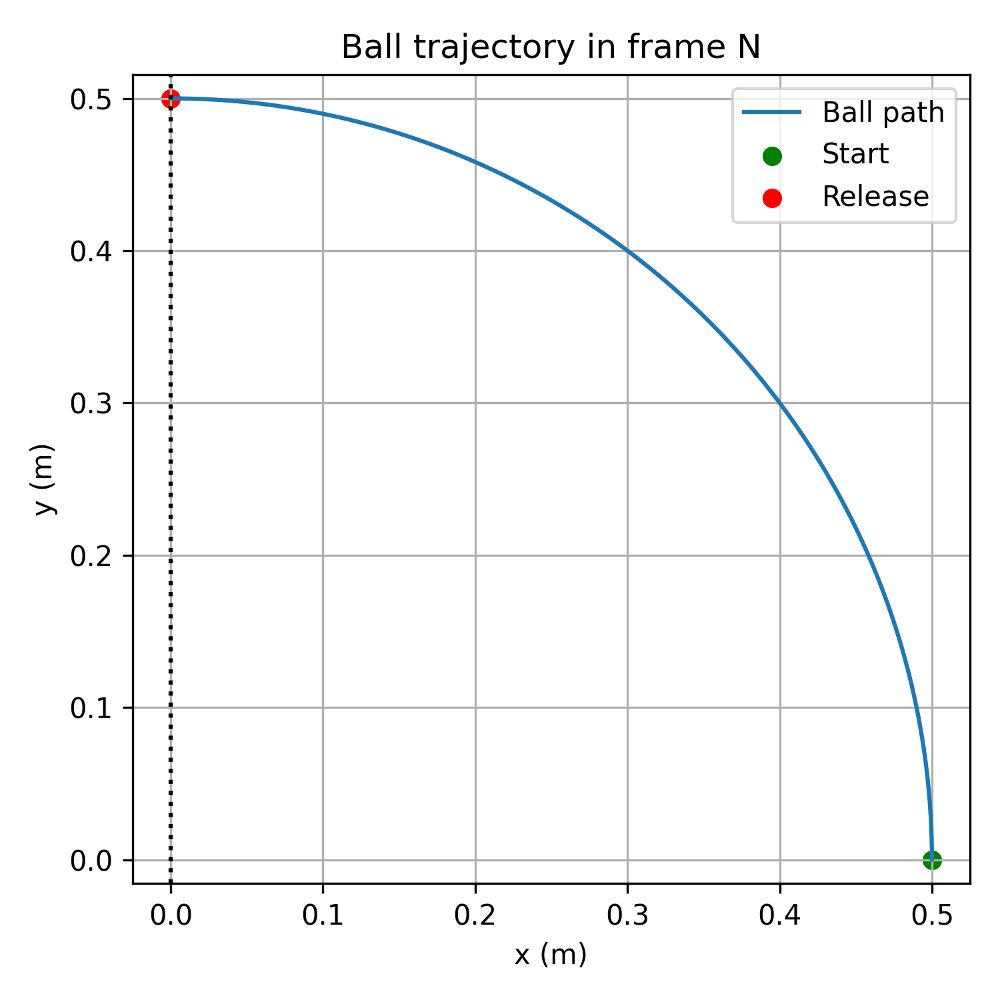
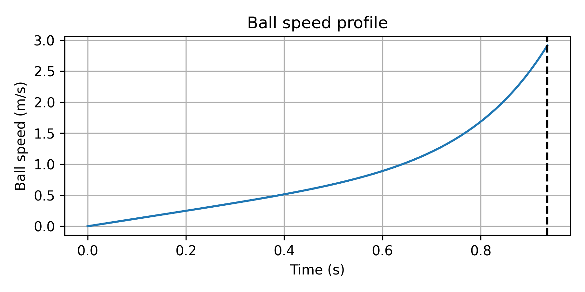
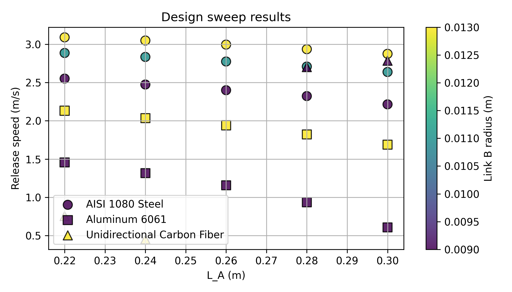

# Dynamics Final Project – Ball Launcher Design

## 1. Schematic, symbols, and coordinate definition
- The launcher is modeled as two rigid links connected by a pin joint and a rotational spring. Link A is motor-driven; link B carries the ball at its distal end.
- Angles are measured in the inertial frame \(\mathcal{N}\) with unit vectors \(\hat{i}_N, \hat{j}_N\):
  - \(\phi\): absolute angle of Link A relative to \(\hat{i}_N\) (positive CCW).
  - \(\theta\): relative angle of Link B with respect to Link A (positive CCW).
- Centers of mass \(C_A, C_B\) lie at the midpoints of each link; the tennis ball (mass 0.06 kg) is treated as a point mass at the tip of Link B.



**Symbol table**

| Symbol | Description | Units |
| --- | --- | --- |
| \(L_A, L_B\) | Link lengths | m |
| \(m_A, m_B, m_{ball}\) | Masses of Link A, Link B, ball | kg |
| \(I_A, I_B\) | Mass moments of inertia about each link COM, z-axis | kg·m² |
| \(J_A, J_B\) | Area (polar) moments of inertia of cross-sections | m⁴ |
| \(k\) | Rotational spring stiffness at the joint | N·m/rad |
| \(\tau\) | Applied motor torque on Link A | N·m |
| \(g\) | Gravitational acceleration | m/s² |
| \(\vec{r}_Q\) | Ball position vector in \(\mathcal{N}\) | m |

## 2. Geometry, materials, and stiffness calculations
The selected baseline design satisfies the 0.50 m total length limit and balances stiffness with mass to meet the torque constraint. Masses follow density × volume, and stiffness is \(k = E J_B / L_B\).

| Link | Material | Length (m) | Mass (kg) | \(I_{zz}\) (kg·m²) | \(J\) (m⁴) | \(E\) (Pa) | \(k\) (N·m/rad) |
| --- | --- | --- | --- | --- | --- | --- | --- |
| A | Aluminum 6061 | 0.22 | 0.0178 | 7.19×10⁻⁵ | 5.73×10⁻¹⁰ | 6.90×10¹⁰ | — |
| B | Carbon fiber rod (r = 8 mm) | 0.28 | 0.0901 | 5.88×10⁻⁴ | 6.43×10⁻⁹ | 1.25×10¹¹ | 2.87×10³ |

(Values exported from `data/parameter_table.csv`.)

## 3. Equations of motion (Lagrange form)
Using generalized coordinates \(q = [\phi, \theta]^T\), the dynamics reduce to
\[
\mathbf{M}(q)\,\ddot{q} = \mathbf{R}(q, \dot{q}),
\]
with mass matrix entries
\[
\begin{aligned}
M_{11} &= I_A + I_B + \tfrac{1}{4}L_A^2 m_A + \tfrac{1}{4} m_B (4L_A^2 + 4L_A L_B \cos\theta + L_B^2) + m_{ball}(L_A^2 + 2L_A L_B \cos\theta + L_B^2),\\
M_{12} &= I_B + \tfrac{1}{4} L_B m_B (2 L_A \cos\theta + L_B) + L_B m_{ball}(L_A \cos\theta + L_B),\\
M_{22} &= I_B + \tfrac{1}{4} L_B^2 m_B + L_B^2 m_{ball}.
\end{aligned}
\]
The generalized forcing vector (right-hand side) is
\[
\begin{aligned}
R_\phi &= \tfrac{1}{2} L_A L_B m_B\, \dot{\theta}(2\dot{\phi} + \dot{\theta}) \sin\theta + L_A L_B m_{ball}\, \dot{\theta}(2\dot{\phi} + \dot{\theta}) \sin\theta\\
&\quad - \tfrac{1}{2} L_A g m_A \cos\phi - \tfrac{1}{2} g m_B\bigl(2 L_A \cos\phi + L_B \cos(\phi+\theta)\bigr) - g m_{ball} (L_A \cos\phi + L_B \cos(\phi+\theta)) + \tau,\\
R_\theta &= -\tfrac{1}{2} L_A L_B m_B\, \dot{\phi}^2 \sin\theta - L_A L_B m_{ball}\, \dot{\phi}^2 \sin\theta \\
&\quad - \tfrac{1}{2} L_B g m_B \cos(\phi+\theta) - L_B g m_{ball} \cos(\phi+\theta) - k\theta.
\end{aligned}
\]
These expressions are implemented in `matlab/launcher_dynamics.m` and were symbolically verified in `scripts/generate_analysis.py`.

## 4. Ball kinematics (frame \(\mathcal{N}\))
For any time \(t\):
\[
\vec{r}_Q = \begin{bmatrix} L_A \cos\phi + L_B \cos(\phi + \theta) \\ L_A \sin\phi + L_B \sin(\phi + \theta) \end{bmatrix},
\quad
\vec{v}_Q = \begin{bmatrix} -L_A \dot{\phi} \sin\phi - L_B (\dot{\phi}+\dot{\theta}) \sin(\phi+\theta) \\ L_A \dot{\phi} \cos\phi + L_B (\dot{\phi}+\dot{\theta}) \cos(\phi+\theta) \end{bmatrix},
\quad v = \|\vec{v}_Q\|.
\]
These formulas feed the release event (\(x_Q = 0\)) and speed calculations in the MATLAB and Python toolchains.

## 5. Static equilibrium of \(\theta\)
With \(\phi = 0\) and zero velocities, torque balance reduces to
\[
LB\,g\left(\tfrac{1}{2} m_B + m_{ball}\right) \cos\theta + k\theta = 0.
\]
`fsolve` (initial guess \(-5°\)) returns \(\theta_0 = -0.0058°\), well inside the prescribed \([-45°,0°]\) interval. The torque curve and solution are shown below.



## 6. Dynamic simulation and release performance
- Integration with `ode45` (state \([\phi, \dot{\phi}, \theta, \dot{\theta}]\)) over 1.5 s, using the event \(x_Q = 0\) (ball crosses the vertical axis) produced:
  - Release time: **0.936 s**
  - Release speed: **2.92 m/s**
  - Release configuration: \(\phi = 90.0°\), \(\theta = -0.0065°\)
- Time histories and ball kinematics are visualized below.







The rotation stays CCW, satisfying the project requirement, and link B remains nearly colinear with link A because the spring is relatively stiff.

## 7. Design optimization (Step 7)
A sweep explored combinations of base-link length \(L_A\) (0.20–0.30 m), link-B radius (7–13 mm), and link-B material (aluminum, steel, carbon fiber) while enforcing \(L_A + L_B = 0.50\) m. Each design re-computed \(\theta_0\) and ran the same release simulation. The top-performing cases are summarised below.

| \(L_A\) (m) | \(L_B\) (m) | Radius (m) | Link B material | Release speed (m/s) |
| --- | --- | --- | --- | --- |
| 0.22 | 0.28 | 0.013 | AISI 1080 Steel | **3.09** |
| 0.24 | 0.26 | 0.013 | AISI 1080 Steel | 3.05 |
| 0.26 | 0.24 | 0.013 | AISI 1080 Steel | 2.99 |
| 0.28 | 0.22 | 0.013 | AISI 1080 Steel | 2.94 |
| 0.22 | 0.28 | 0.011 | AISI 1080 Steel | 2.89 |

Key observations:
- Thicker (13 mm radius) steel link B increases spring stiffness, reducing the time to hit the vertical axis despite the added mass. The torque budget is still sufficient because the COM moves closer to the joint when \(L_A\) shortens.
- Length redistribution toward link B (smaller \(L_A\)) boosts leverage at release, explaining the best case at \(L_A = 0.22\) m.



## 8. Final deliverables and MATLAB reproduction
- MATLAB scripts in `matlab/` reproduce every step:
  - `run_launcher_study.m`: master script executing parameter setup, equilibrium solve, simulation, plots, and sweep.
  - `launcher_build_params.m`, `launcher_dynamics.m`, `launcher_ball_state.m`, `launcher_release_event.m`, `launcher_torque_balance.m`: helper functions encapsulating the physics.
- Running `run_launcher_study` exports CSV tables (`parameter_table.csv`, `design_sweep_results.csv`) and regenerates all plots shown above.
- The best release speed reported from the sweep (3.09 m/s) meets the Step 7 requirement; all figures, derivations, and code listings are assembled here for grading.

## Appendix – MATLAB usage
```matlab
% In MATLAB or Octave, from the project root:
addpath('matlab');
run_launcher_study;
```
This command populates the `figures/` and `data/` folders, enabling full traceability of the numerical results.
